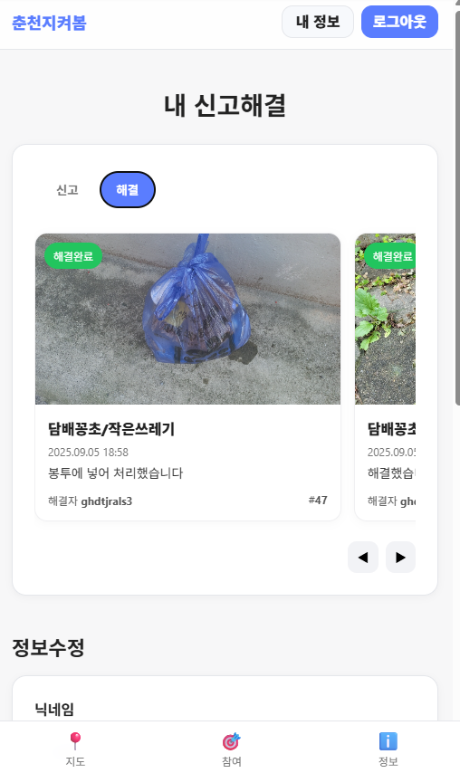

# CCHACK
춘천시 해커톤 공모전 참여 레포지토리

## 소개
춘천시 시민참여형 서비스 아이디어를 빠르게 검증하기 위해 만든 웹 애플리케이션
- Spring Boot 기반의 서버
- 정적 리소스와 HTML/CSS/JS로 화면 제공
- 레포지토리는 Apache-2.0 라이선스 사용
- 주 사용 언어 비중: CSS, HTML, JavaScript, Java

## 핵심 기능
- 시민 참여 화면: 신고/미션 폼과 지도 보기
- 데이터 처리: 서버 사이드 파라미터 검증과 라우팅
- 정적 페이지: 빠른 시연용 반응형 UI
- 스크립트 자동화: 빌드, 실행, 배포 보조 스크립트

## 기술 스택
- 백엔드: Java 17+, Spring Boot 3.x, Maven
- 프론트엔드: HTML, CSS, JavaScript(순정)
- 운영: Maven Wrapper, 간단 스크립트(scripts/)

## UX/UI

  
홈 화면

  

    
  

  
쓰레기 해결 지도

  

    
    
    
  

  

  ### 쓰레기 신고 과정
  https://github.com/user-attachments/assets/ef3aa03f-648e-4093-97ef-9fed2f4986c9
      
  ### 쓰레기 해결 과정
  https://github.com/user-attachments/assets/3e57e0ae-4721-4243-81a9-768770d9b445

  

  
개인 미션

  

    
    
  

  

    
    
  

  
쓰레기 배출 요령

  

    
    
  

  
마이페이지

  

    
    
  

